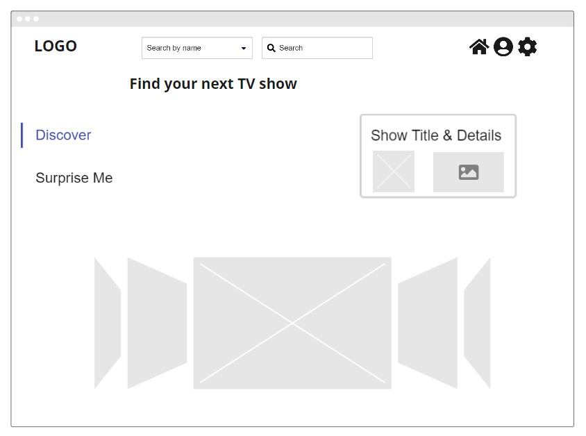

# TV Show Finder
👋 Welcome to TV show finder site created as part of week 12 activities of Python course. 🐍

## Activities
1. Create product site wireframe. - [x]
2. Implement static site. - [ ]
3. Upload the static site to Netlify. - [ ]
4. Move site to Flask. - [ ] 
5. Implement template engine using Jinja. - [ ]
6. Create virtual environment. - [ ]
7. Upload dynamic site to Heroku. - [ ]

### Wireframe
